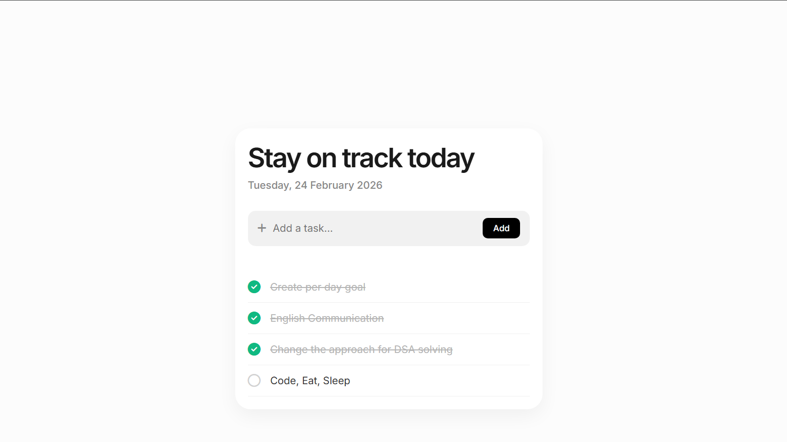

# ✅ To-Do App

A simple and efficient To-Do application designed to manage daily tasks with ease.  
Built with a focus on clean UI, smooth functionality, and productivity.

---

## 🚀 Live Demo

🔗 [View Live Project](https://satyam-2x.github.io/to-do-list/)

---

## 📸 Preview




---

## ✨ Features

- Add new tasks  
- Mark tasks as completed  
- Delete tasks  
- Persistent data  
- Responsive and user-friendly interface  

---

## 🛠️ Tech Stack

- HTML5  
- CSS3  
- JavaScript  
- Local Storage (for saving tasks)  
- Git & GitHub  

---

## ⚙️ How It Works

Users can add tasks to the list, mark them as completed, and remove them when finished.  
The app dynamically updates the UI and stores tasks locally (if implemented).

---

## 📦 Installation

1. Clone the repository  
   ```bash
   git clone https://github.com/satyam-2x/to-do-list.git